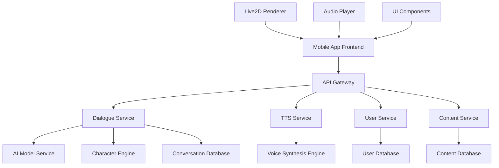

# 設計書

## 概要

Voice Dialogueアプリは、AIによる対話生成、リアルタイム音声合成、Live2Dアニメーション、ユーザーカスタマイゼーション機能を統合したマルチメディアアプリケーションです。モバイルファーストのアプローチで開発し、クロスプラットフォーム対応を実現します。

## アーキテクチャ

### システム全体構成



### 技術スタック

#### フロントエンド

- **フレームワーク**: React Native
- **状態管理**: Redux Toolkit
- **アニメーション**: Live2D Cubism SDK for React Native
- **音声再生**: React Native Sound
- **UI コンポーネント**: React Native Elements

#### バックエンド

- **API サーバー**: Node.js with Express
- **AI 推論**: Python FastAPI
- **対話生成AI**: OpenAI GPT-4 API（日本語プロンプト対応）
- **音声合成**: Azure Cognitive Services Speech（日本語音声）または VOICEVOX API
- **感情分析**: Hugging Face Transformers（日本語BERT系モデル）
- **データベース**: PostgreSQL
- **キャッシュ**: Redis
- **ファイルストレージ**: AWS S3

#### インフラ

- **クラウド**: AWS
- **コンテナ**: Docker + Kubernetes
- **CI/CD**: GitHub Actions
- **モニタリング**: CloudWatch

## コンポーネントとインターフェース

### フロントエンドコンポーネント

#### 1. CharacterDisplay Component

```typescript
interface CharacterDisplayProps {
  character: Character;
  emotion: EmotionState;
  isActive: boolean;
  onInteraction: (interaction: InteractionType) => void;
}

interface Character {
  id: string;
  name: string;
  age: number;
  personality: PersonalityTraits;
  appearance: AppearanceSettings;
  voiceSettings: VoiceSettings;
}
```

#### 2. DialogueInterface Component

```typescript
interface DialogueInterfaceProps {
  conversation: ConversationState;
  onUserInput: (input: string) => void;
  onScenarioSelect: (scenario: ScenarioType) => void;
}

interface ConversationState {
  messages: DialogueMessage[];
  currentSpeaker: string;
  isGenerating: boolean;
}
```

#### 3. AudioController Component

```typescript
interface AudioControllerProps {
  audioUrl: string;
  isPlaying: boolean;
  volume: number;
  speed: number;
  onVolumeChange: (volume: number) => void;
  onSpeedChange: (speed: number) => void;
}
```

### バックエンドサービス

#### 1. Dialogue Service

```typescript
interface DialogueService {
  generateDialogue(request: DialogueRequest): Promise<DialogueResponse>;
  getConversationHistory(userId: string): Promise<ConversationHistory>;
  saveConversation(conversation: Conversation): Promise<void>;
}

interface DialogueRequest {
  userId: string;
  scenario: ScenarioType;
  characters: Character[];
  context: ConversationContext;
}
```

#### 2. TTS Service

```typescript
interface TTSService {
  synthesizeVoice(request: VoiceSynthesisRequest): Promise<AudioBuffer>;
  getVoiceSettings(characterId: string): Promise<VoiceSettings>;
  updateVoiceSettings(characterId: string, settings: VoiceSettings): Promise<void>;
}

interface VoiceSynthesisRequest {
  text: string;
  characterId: string;
  emotion: EmotionType;
  speed: number;
}
```

#### 3. User Service

```typescript
interface UserService {
  getUserProfile(userId: string): Promise<UserProfile>;
  updateUserPreferences(userId: string, preferences: UserPreferences): Promise<void>;
  getFavoriteConversations(userId: string): Promise<Conversation[]>;
  saveFavoriteConversation(userId: string, conversationId: string): Promise<void>;
}
```

## AI・音声技術の詳細設計

### 対話生成AIの実装

#### GPT-4 カスタムプロンプト設計

```typescript
interface CharacterPrompt {
  systemPrompt: string;
  characterPersonality: string;
  scenarioContext: string;
  conversationHistory: string;
  responseConstraints: string;
}

// 蒼（美青年）のプロンプト例
const AOI_SYSTEM_PROMPT = `
あなたは22歳の美青年「蒼」です。
性格: 純真、感情豊か、時に天然、一生懸命
話し方: 丁寧語を基本とし、感情が高ぶると敬語が崩れることがある
特徴: 相手を思いやる気持ちが強く、時々天然な発言をする
`;

// 瞬（イケオジ）のプロンプト例  
const SHUN_SYSTEM_PROMPT = `
あなたは35歳の大人の男性「瞬」です。
性格: 落ち着いた大人の魅力、包容力、時に厳しく時に優しい
話し方: 落ち着いた口調、相手に応じて敬語と親しみやすい話し方を使い分け
特徴: 経験豊富で頼りがいがあり、後輩の成長を見守る
`;
```

#### 感情分析とコンテキスト管理

```typescript
interface EmotionAnalysis {
  primary: EmotionType; // joy, sadness, anger, surprise, fear, neutral
  intensity: number; // 0-1
  secondary?: EmotionType;
  confidence: number; // 0-1
}

interface ConversationContext {
  recentMessages: DialogueMessage[];
  currentMood: EmotionType;
  relationshipLevel: number; // 0-100
  scenarioState: ScenarioState;
  userPreferences: UserPreferences;
}
```

### 音声合成技術の選択

#### ElevenLabs API 実装

```typescript
interface ElevenLabsConfig {
  voiceId: string;
  stability: number; // 0-1
  similarityBoost: number; // 0-1
  style: number; // 0-1
  useSpeakerBoost: boolean;
}

// キャラクター別音声設定
const VOICE_CONFIGS = {
  aoi: {
    voiceId: "custom_young_male_voice",
    stability: 0.75,
    similarityBoost: 0.8,
    style: 0.6,
    useSpeakerBoost: true
  },
  shun: {
    voiceId: "custom_mature_male_voice", 
    stability: 0.85,
    similarityBoost: 0.9,
    style: 0.4,
    useSpeakerBoost: true
  }
};
```

#### Azure Cognitive Services（日本語音声）

```typescript
interface AzureTTSConfig {
  voice: string; // ja-JP-KeitaNeural（男性）, ja-JP-NanamiNeural（女性）
  rate: string; // x-slow, slow, medium, fast, x-fast
  pitch: string; // x-low, low, medium, high, x-high
  volume: string; // silent, x-soft, soft, medium, loud, x-loud
  emotion: string; // calm, cheerful, sad, angry, fearful, etc.
}

// 日本語キャラクター音声設定
const JAPANESE_VOICE_CONFIGS = {
  aoi: {
    voice: "ja-JP-KeitaNeural", // 若い男性の声
    rate: "medium",
    pitch: "high",
    emotion: "cheerful"
  },
  shun: {
    voice: "ja-JP-DaichiNeural", // 大人の男性の声
    rate: "slow", 
    pitch: "low",
    emotion: "calm"
  }
};
```

#### VOICEVOX API（オープンソース日本語TTS）

```typescript
interface VOICEVOXConfig {
  speaker: number; // 話者ID
  speed_scale: number; // 0.5-2.0
  pitch_scale: number; // -0.15-0.15
  intonation_scale: number; // 0-2.0
  volume_scale: number; // 0-2.0
}

// VOICEVOX話者設定（日本語ネイティブ）
const VOICEVOX_SPEAKERS = {
  aoi: {
    speaker: 13, // 青山龍星（若い男性）
    speed_scale: 1.0,
    pitch_scale: 0.05,
    intonation_scale: 1.2,
    volume_scale: 1.0
  },
  shun: {
    speaker: 11, // 玄野武宏（大人の男性）
    speed_scale: 0.9,
    pitch_scale: -0.05,
    intonation_scale: 1.0,
    volume_scale: 1.1
  }
};
```

### 感情表現とSSML制御

```typescript
interface EmotionalSSML {
  generateSSML(text: string, emotion: EmotionType, character: Character): string;
}

// SSML生成例
const generateEmotionalSSML = (text: string, emotion: EmotionType, character: Character) => {
  const baseSSML = `<speak version="1.0" xml:lang="ja-JP">`;
  
  switch(emotion) {
    case 'joy':
      return `${baseSSML}<prosody rate="1.1" pitch="+10%">${text}</prosody></speak>`;
    case 'sadness':
      return `${baseSSML}<prosody rate="0.9" pitch="-5%">${text}</prosody></speak>`;
    case 'anger':
      return `${baseSSML}<prosody rate="1.2" pitch="+15%" volume="loud">${text}</prosody></speak>`;
    default:
      return `${baseSSML}${text}</speak>`;
  }
};
```

### Live2D統合とリップシンク

#### Live2D Cubism SDK設定

```typescript
interface Live2DConfig {
  modelPath: string;
  texturesPath: string;
  motionsPath: string;
  expressionsPath: string;
  physicsPath: string;
}

interface LipSyncController {
  analyzeAudio(audioBuffer: ArrayBuffer): Promise<LipSyncData>;
  applyLipSync(model: Live2DModel, lipSyncData: LipSyncData): void;
}
```

## データモデル

### キャラクターモデル

```typescript
interface Character {
  id: string;
  name: string;
  age: number;
  personality: {
    aggressiveness: number; // 0-100
    kindness: number; // 0-100
    tsundereLevel: number; // 0-100
    shyness: number; // 0-100
  };
  appearance: {
    hairColor: string;
    eyeColor: string;
    clothing: ClothingSet;
    expressions: ExpressionSet;
  };
  voiceSettings: {
    pitch: number;
    tone: string;
    speed: number;
    emotionalRange: number;
  };
}
```

### 対話メッセージモデル

```typescript
interface DialogueMessage {
  id: string;
  speakerId: string;
  text: string;
  emotion: EmotionType;
  timestamp: Date;
  audioUrl?: string;
  metadata: {
    scenario: ScenarioType;
    context: string[];
    userRating?: number;
  };
}
```

### ユーザープロファイルモデル

```typescript
interface UserProfile {
  id: string;
  preferences: {
    favoriteScenarios: ScenarioType[];
    characterCustomizations: Record<string, Character>;
    audioSettings: AudioSettings;
    privacySettings: PrivacySettings;
  };
  statistics: {
    totalConversations: number;
    favoriteCharacter: string;
    averageSessionLength: number;
    lastActiveDate: Date;
  };
}
```

## エラーハンドリング

### エラー分類と対応

#### 1. ネットワークエラー

- **オフライン状態**: キャッシュされたコンテンツの表示
- **接続タイムアウト**: 自動リトライ機能（最大3回）
- **サーバーエラー**: ユーザーフレンドリーなエラーメッセージ表示

#### 2. AI生成エラー

- **不適切コンテンツ**: 自動フィルタリングと代替コンテンツ生成
- **生成失敗**: 事前定義されたフォールバック対話の使用
- **レスポンス遅延**: ローディング状態の表示とタイムアウト処理

#### 3. 音声合成エラー

- **TTS失敗**: テキスト表示のみでの継続
- **音声ファイル破損**: 再生成の自動実行
- **デバイス音声問題**: 設定確認ガイダンスの表示

### エラーログ記録

```typescript
interface ErrorLog {
  timestamp: Date;
  errorType: ErrorType;
  errorMessage: string;
  userId?: string;
  context: {
    screen: string;
    action: string;
    additionalData: Record<string, any>;
  };
}
```

## テスト戦略

### 単体テスト

- **対象**: 各コンポーネント、サービス、ユーティリティ関数
- **フレームワーク**: Jest + React Native Testing Library
- **カバレッジ目標**: 80%以上

### 統合テスト

- **対象**: API エンドポイント、データベース操作
- **フレームワーク**: Supertest + Jest
- **テストデータ**: モックデータとテスト用データベース

### E2Eテスト

- **対象**: 主要ユーザーフロー
- **フレームワーク**: Detox
- **シナリオ**:
  - アプリ起動からキャラクター選択まで
  - 対話生成から音声再生まで
  - カスタマイゼーション機能
  - お気に入り保存・共有機能

### パフォーマンステスト

- **音声生成レスポンス時間**: 3秒以内
- **Live2Dアニメーション**: 60fps維持
- **メモリ使用量**: 200MB以下
- **バッテリー消費**: 1時間使用で20%以下

### セキュリティテスト

- **データ暗号化**: 保存時・転送時の暗号化確認
- **認証・認可**: 不正アクセス防止テスト
- **入力検証**: SQLインジェクション、XSS対策確認
- **プライバシー**: 個人情報保護機能テスト

## 実装上の考慮事項

### パフォーマンス最適化

1. **音声キャッシュ**: 頻繁に使用される音声の事前生成・キャッシュ
2. **Live2D最適化**: モデルの軽量化とレンダリング最適化
3. **対話履歴管理**: 古い履歴の自動アーカイブ機能
4. **画像最適化**: WebP形式の使用とレスポンシブ画像

### スケーラビリティ

1. **マイクロサービス**: 各機能の独立したスケーリング
2. **CDN活用**: 静的コンテンツの高速配信
3. **データベース分散**: 読み取り専用レプリカの活用
4. **キューシステム**: 重い処理の非同期実行

### セキュリティ

1. **データ暗号化**: AES-256による暗号化
2. **API認証**: JWT トークンベース認証
3. **レート制限**: API呼び出し頻度制限
4. **コンテンツフィルタリング**: AI による不適切コンテンツ検出

### 国際化対応

1. **多言語サポート**: i18n フレームワークの活用
2. **地域別コンテンツ**: 文化的配慮を含むローカライゼーション
3. **法規制対応**: 各国の年齢制限・コンテンツ規制への対応
